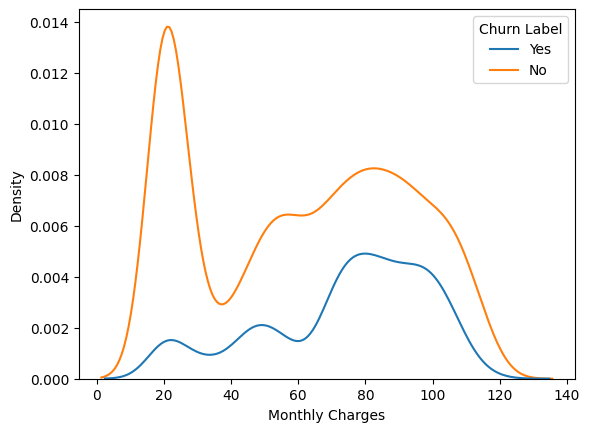
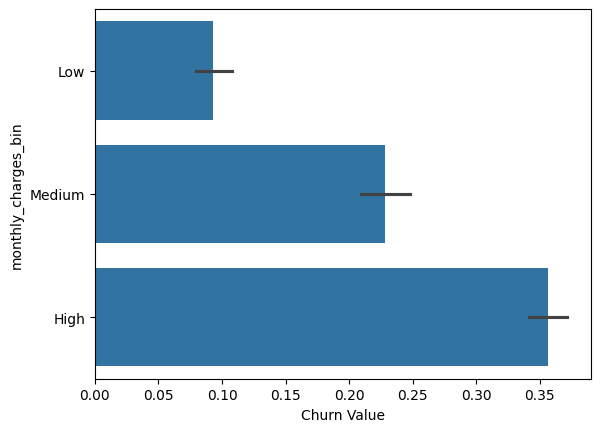
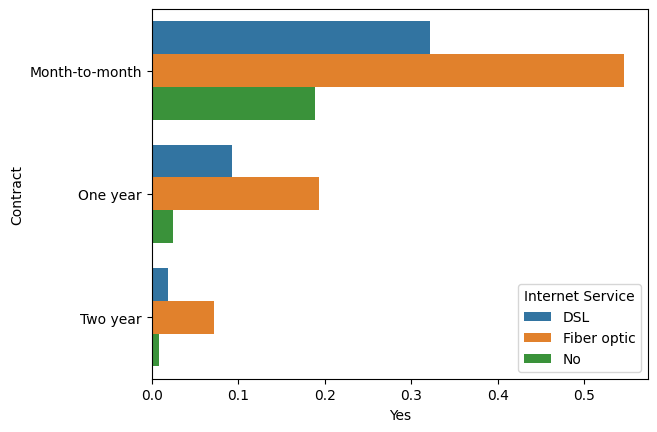

# Customer Churn Analysis (SQL + Python)

## Project Overview
This project analyzes customer churn behavior in a subscription-based business to identify **key factors influencing customer retention**. Using SQL and Python, the analysis explores patterns in customer tenure, contract type, pricing, and service usage to understand why customers leave.

The goal is to demonstrate strong analytical thinking, SQL proficiency, and the ability to translate data into actionable business insights.

---

# Business Problem

Customer churn is a critical issue for subscription businesses, directly impacting revenue and growth.

This project aims to answer:

* What is the overall churn rate?
* Which customers are most likely to churn?
* What factors are associated with higher churn?
* What patterns appear before customers churn?

---

# Dataset

The dataset used was downloaded from [kaggle dataset](https://www.kaggle.com/datasets/yeanzc/telco-customer-churn-ibm-dataset) which contains customer-level information from a telecom subscription business, including:

* Customer demographics
* Account information (tenure, contract type)
* Service usage (internet service, support)
* Billing information (monthly charges)
* Churn status (Yes/No)


---

# Tools Used

* **SQL (SQLite)** — Core analysis and segmentation
* **Python (pandas, matplotlib)** — Data cleaning and visualization
* **Kaggle Notebook** — Analysis environment
* **GitHub** — Project documentation

---

# Analysis Approach

### 1. Data Cleaning

* Converted data types (e.g., TotalCharges to numeric)
* Handled missing values (although None lol.)
* Transformed churn variable into binary format (It's already provided, dude)

---

### 2. Exploratory Data Analysis (EDA)

Key analyses performed:

* Overall churn rate
* Churn by tenure group  
* Churn by contract type
* Churn by monthly charges
* Customer segmentation using multiple variables (contract and internet service)

### 2B. EDA Sample Results
* Churn by monthly charges
    
    
* Customer segmentation
    

---

### 3. SQL Analysis

SQL was used to:

* Aggregate churn rates across customer segments
* Identify high-risk groups
* Perform grouped analysis (contract, tenure, services)

All queries are available in the `sql/queries.sql` file.

---

# Key Insights 
So, a copy-paste from the notebook's GPTied version? great. 

1. **Overall churn rate is approximately 26.5%**, indicating a significant portion of customers leave the service.

2. **Tenure is strongly associated with churn**

   * Customers with shorter tenure are much more likely to churn
   * Long-term customers are significantly more stable

3. **Contract type is a major driver of churn**

   * Month-to-month contracts have the highest churn rate
   * Long-term contracts (1–2 years) significantly reduce churn

4. **Higher monthly charges are linked to higher churn**

   * Customers who churn tend to have higher monthly costs
   * This suggests potential price sensitivity or perceived low value

5. **High-risk customer segment identified**

   * Customers with fiber optic internet and month-to-month contracts exhibit the highest churn rates

---

# Business Interpretation

The analysis suggests that churn is driven by a combination of:

* **Low commitment** (month-to-month contracts)
* **Early-stage customers** (short tenure)
* **Higher cost burden** (higher monthly charges)

These factors indicate that customers are most vulnerable to churn when they have not yet built long-term engagement and perceive lower value relative to cost.

---

# Recommendations

Based on the findings:

* Encourage customers to switch to **long-term contracts** through incentives
* Improve **onboarding experience** for new customers to reduce early churn
* Review pricing strategy for **high-cost segments**
* Target high-risk groups with **retention campaigns** (e.g., fiber optic + month-to-month users)

---

# Project Structure

```
churn-analysis/
│
├── data/
│   └── telco_churn.xlsx
│
├── notebooks/
│   └── churn-analysis-in-kaggle.ipynb
│
├── sql/
│   └── queries.sql
│
└── README.md
```

---

# Conclusion

This project demonstrates how SQL and Python can be used to analyze customer behavior, identify churn drivers, and generate actionable insights. The approach reflects a typical workflow for data analysts working on customer retention and subscription analytics problems.


## About Me
This is a part of my data science portfolio -- 
built during my free time as a jobless loafer. More projects or anything else, proceed:
[GitHub](https://github.com/irdazh) |
[Kaggle](https://www.kaggle.com/irdazh) |
[LinkedIn](https:///www.linkedin.com/in/daud-ma)

#### Author's Note (Just Ignore)
- Create folders and files: gitignore, readme
- Create .venv --- for now, i guess we don't need it. 
- Launch git
- Create GitHub repo: make a new remote in github >> git remote add origin just-link-without-text-maker >> >> git branch -M main >> git push -u origin main
